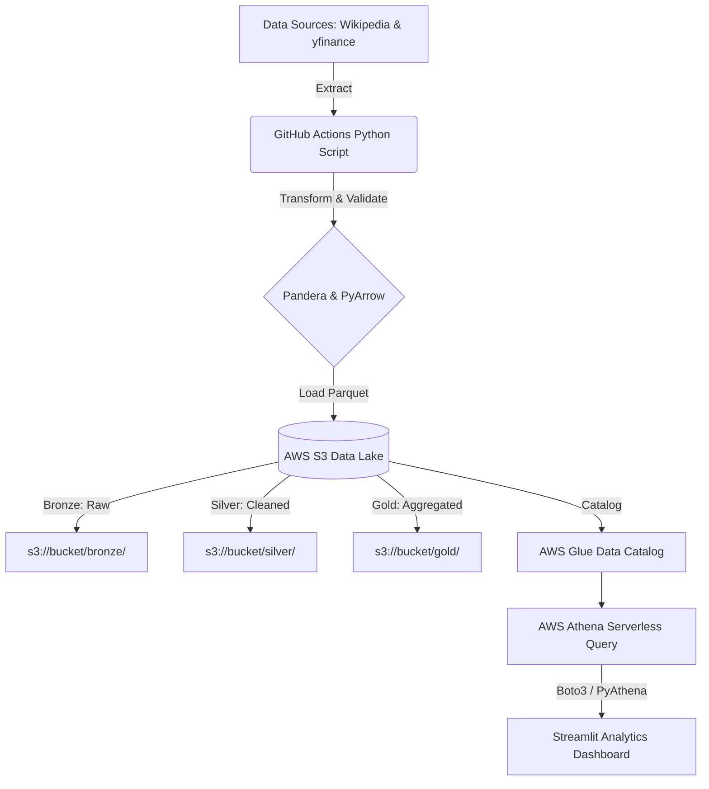

# Automated Market Data ETL Pipeline & Analytics Dashboard

Welcome to the **Automated Market Data ETL Pipeline & Analytics Dashboard**. This is a complete, production-grade automated platform designed to extract, transform, and load (ETL) S&P 500 market data into an AWS S3 Medallion Data Lake, query it via AWS Athena, and visualize it through a Streamlit Analytics Dashboard.

## 🌟 Project Master Overview

This repository houses the entire end-to-end infrastructure and code for the automated data pipeline.

### Core Capabilities
1. **Automated Extraction**: Nightly extractions of the S&P 500 constituency list from Wikipedia and corresponding market data via `yfinance`.
2. **Medallion Data Architecture**: Data is rigorously validated, cleaned, and partitioned, flowing through `Bronze` (Raw), `Silver` (Cleaned), and `Gold` (Aggregated) layers in AWS S3.
3. **Infrastructure as Code (IaC)**: The entire AWS backend (S3 Bucket, Glue Catalog, IAM Roles, Athena Workgroup) is fully automated and provisioned via Terraform.
4. **CI/CD & Automation**: GitHub Actions handles linting, testing, and nightly cron-triggered ETL pipeline execution.
5. **Interactive Analytics**: A local Streamlit dashboard that connects securely to AWS Athena to deliver high-performance visual insights on sector growth, KPI metrics, and top-performing stocks.

---

## 🏗️ Architecture Blueprint



---

## 📁 Repository Structure

```text
.
├── .github/                  # GitHub Actions CI/CD workflows, issue/PR templates
│   └── workflows/
│       ├── etl_cron.yml      # The automation engine that runs nightly
│       └── ci.yml            # Continuous integration (Linting & Testing)
├── dashboard/                # Analytics Dashboard App
│   ├── app.py                # Main Streamlit application
│   └── components/           # Reusable UI components (KPI cards, charts, filters)
├── src/                      # Core Pipeline Source Code
│   ├── extractors/           # Wikipedia & yfinance extraction logic
│   ├── transformers/         # Data cleaning & schema validation (Pandera)
│   ├── loaders/              # AWS S3 Parquet uploading and partitioning
│   └── utils/                # Logging, configuration, and AWS clients
├── terraform/                # Infrastructure as Code (AWS Provisioning)
│   ├── main.tf               # S3, Glue, Athena, IAM resource definitions
│   └── variables.tf          # Configurable AWS variables
├── tests/                    # Pytest suite for the pipeline
├── scripts/                  # Helper bash scripts
├── requirements.txt          # Production Python dependencies
└── USER_MANUAL.md            # Comprehensive user guide on how to operate the project
```

---

## 🚀 How It Works (The Automation Engine)

This project requires **zero daily manual intervention**.
1. Every day at 02:00 UTC, **GitHub Actions** triggers the `Nightly ETL Pipeline`.
2. A cloud runner spins up, installs Python dependencies, and runs the extraction suite.
3. Data is fetched, validated against strict `Pandera` schemas, converted into compressed columnar `Parquet` format, and partitioned by date.
4. The runner securely authenticates with AWS using GitHub Secrets and uploads the Parquet files to the **S3 Data Lake**.
5. **AWS Glue** catalogs the new partitions, making them instantly queryable by **AWS Athena**.
6. When a user opens the **Streamlit Dashboard**, it sends optimized SQL queries directly to Athena, crunching millions of rows in seconds, and visualizes the results.

---

## 📚 Documentation

For a full guide on where to see the project running, how to access the AWS resources, and how to launch your dashboard, please read the [USER MANUAL](USER_MANUAL.md).

---

## 🛠️ Technology Stack

- **Cloud & Big Data**: AWS S3, AWS Glue, AWS Athena, Boto3
- **Infrastructure as Code**: Terraform
- **Data Engineering**: Pandas, PyArrow, Fastparquet, Pandera
- **Automation & CI/CD**: GitHub Actions
- **Dashboard & UI**: Streamlit, Plotly
- **Language**: Python 3.10+

---

## 📝 License & Contributing

This project is open-source and available under the MIT License. Please review `CONTRIBUTING.md` and `SECURITY.md` for guidelines on submitting pull requests.
