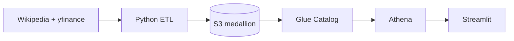

# Automated Market Data Pipeline

S&P 500 **and** Nifty 50 daily bars into an S3 medallion lake (bronze / silver / gold), Glue + Athena, Streamlit dashboard. Terraform + GitHub Actions.

**Owner:** [Aaditya Upadhyay](https://github.com/Addy48)

<p align="center">
  
  
  
  
</p>

---

## What it does

1. Pulls index constituents (Wikipedia) and daily OHLCV (`yfinance`) for **S&P 500** and **Nifty 50**.
2. Validates with **Pandera**, writes partitioned **Parquet** through bronze → silver → gold on S3.
3. Glue catalogs the lake; **Athena** serves SQL; Streamlit reads Athena for sector and KPI views.
4. GitHub Actions runs after each market close: **12:30 UTC** (India) and **21:30 UTC** (US).



---

## Layout

```
src/                 extract / transform / load / config
dashboard/           Streamlit app
terraform/           S3, Glue, Athena, IAM
tests/               pytest (no live AWS required for unit tests)
.github/workflows/   ci.yml + etl_cron.yml
```

---

## Quick start

```bash
git clone https://github.com/Addy48/automated-data-pipeline.git
cd automated-data-pipeline
python3 -m venv .venv && source .venv/bin/activate
pip install -r requirements-dev.txt
pytest -q
```

Terraform and the live lake need AWS credentials. Do not commit `.env` or `terraform.tfvars`.

Dashboard (after AWS is wired):

```bash
streamlit run dashboard/app.py
```

Ops detail: [USER_MANUAL.md](USER_MANUAL.md)

---

## Stack

Python · Pandas · PyArrow · Pandera · AWS S3 / Glue / Athena · Terraform · GitHub Actions · Streamlit · Plotly

---

## License

MIT. See [LICENSE](LICENSE).
